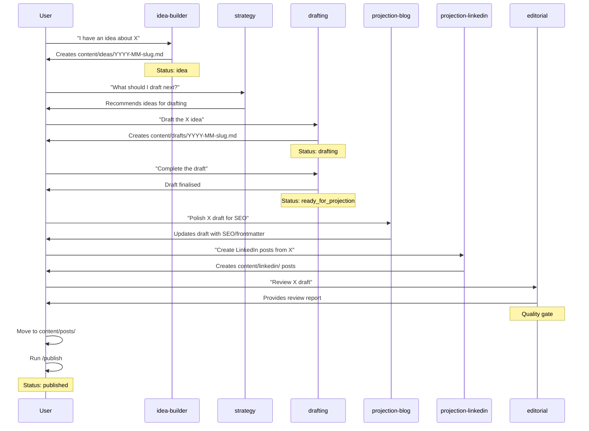
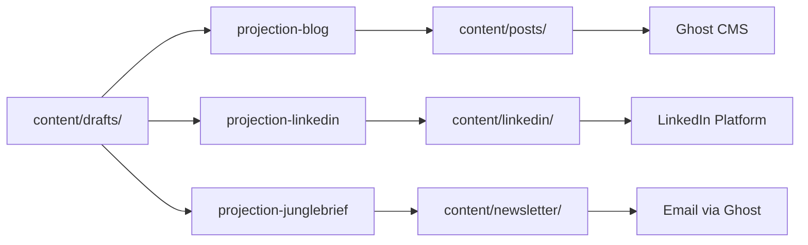

# Content Workflow

## Simplified Status Flow

```
idea → drafting → ready_for_projection → published → archived
```

### Where Content Lives

| Location | Purpose | Edit here? |
|----------|---------|------------|
| `content/ideas/` | Lightweight planning (metadata + outline) | Planning only |
| `content/drafts/` | Blog posts you're writing and editing | **Yes** |
| `content/posts/` | Published blog posts | After publishing |
| `content/linkedin/` | LinkedIn posts | Yes |
| `content/newsletter/` | Newsletter issues | Yes |

### Status Definitions

| Status | Meaning | Next Action |
|--------|---------|-------------|
| idea | Captured concept, outline created | Pick for drafting |
| drafting | Draft exists in `content/drafts/` | Review, edit, polish |
| ready_for_projection | Draft complete, ready for channel adaptation | Create LinkedIn/newsletter projections |
| published | Blog post is live | Monitor performance |
| archived | No longer relevant | None |

## Weekly Rhythm

### Monday: Strategy + Planning (1 hour)

**Strategy Review (30 min):**

- Run `/pipeline` to see current distribution
- Review ideas in `status: idea`
- Pick 1-2 to work on this week
- Check for stale items

**Publishing Calendar (30 min):**

- Schedule content for the week
- Plan: 1 blog post, 3 LinkedIn posts

### Tuesday-Thursday: Execution

**Writing:**

- Create/edit drafts in `content/drafts/`
- Update idea status to `drafting` when you start

**LinkedIn:**

- Create LinkedIn posts (Tue framework, Wed take, Thu lesson)

**Publishing:**

- Review drafts, move to `content/posts/` when ready
- Run `/publish` to sync to Ghost

### Friday: Light Touch

- Quick review of week's performance
- Capture any new ideas
- No heavy writing

### Weekend: Newsletter

- Assemble Jungle Brief issue (bi-weekly)
- Draw from published content
- Schedule for Monday/Tuesday send

## Agent Handoffs

```
idea-builder → creates idea file (status: idea)
                    ↓
strategy-agent → reviews, proposes for drafting
                    ↓
drafting-agent → creates draft in content/drafts/
                 sets idea status: drafting
                    ↓
drafting-agent → completes draft, sets idea status: ready_for_projection
                    ↓
projection-blog → polishes for SEO
projection-linkedin → creates LinkedIn posts
projection-junglebrief → assembles newsletter content
                    ↓
editorial-agent → reviews quality
                    ↓
You → publish (move to posts/, run /publish, set idea status: published)
```

## Agent Handoff Flow (Detailed)

The sequence diagram below shows the detailed interaction between agents during the content creation process.



## Channel Projection Flow

Drafts can be projected to multiple channels simultaneously.



## Key Principle

**Drafts are the working document.** Ideas stay lean (metadata + outline). All blog writing and editing happens in `content/drafts/`.
