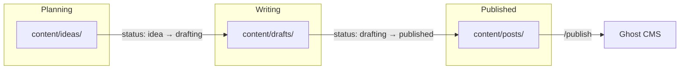

# Content Directory

This directory contains all content for the XavierFuentes.com Content OS.

## Workflow: Idea → Publication

```
ideas/     →     drafts/     →     posts/
(planning)       (writing)         (published)
```

1. **ideas/** - Lightweight planning files with metadata + outline
2. **drafts/** - Full blog content (this is where you write)
3. **posts/** - Published to Ghost (move here when ready to go live)

### Visual Flow



### Status to Directory Mapping

| Status | Directory | Description |
|--------|-----------|-------------|
| `idea` | `content/ideas/` | Captured concept with outline |
| `drafting` | `content/drafts/` | Active writing and editing |
| `published` | `content/posts/` | Live on Ghost |
| `archived` | `content/posts/` | Retired content |

## Projections (Derived Content)

| Directory | Purpose |
|-----------|---------|
| `linkedin/` | LinkedIn posts derived from ideas/drafts |
| `newsletter/` | The Jungle Brief newsletter issues |

## Other Content

| Directory | Purpose |
|-----------|---------|
| `pages/` | Static Ghost pages (About, Newsletter signup, etc.) |
| `assets/` | Lead magnets, checklists, downloadable PDFs |

## Key Principle

**ideas/** = Lean planning (metadata + outline)
**drafts/** = Full working document (edit here)
**posts/** = Published content (don't edit directly)

## Naming Convention

Files follow: `YYYY-MM-slug.md`

Example: `2025-01-build-vs-buy-framework.md`
